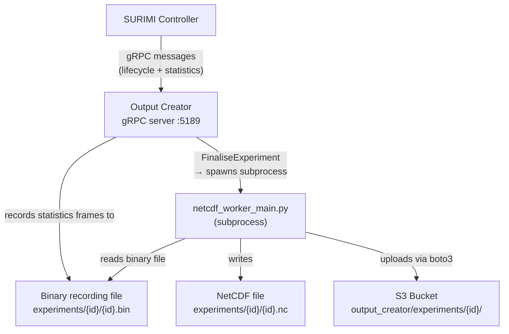
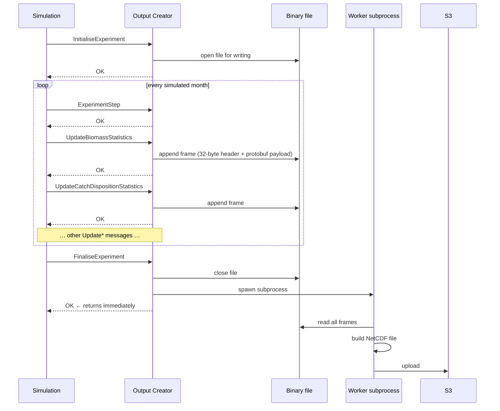
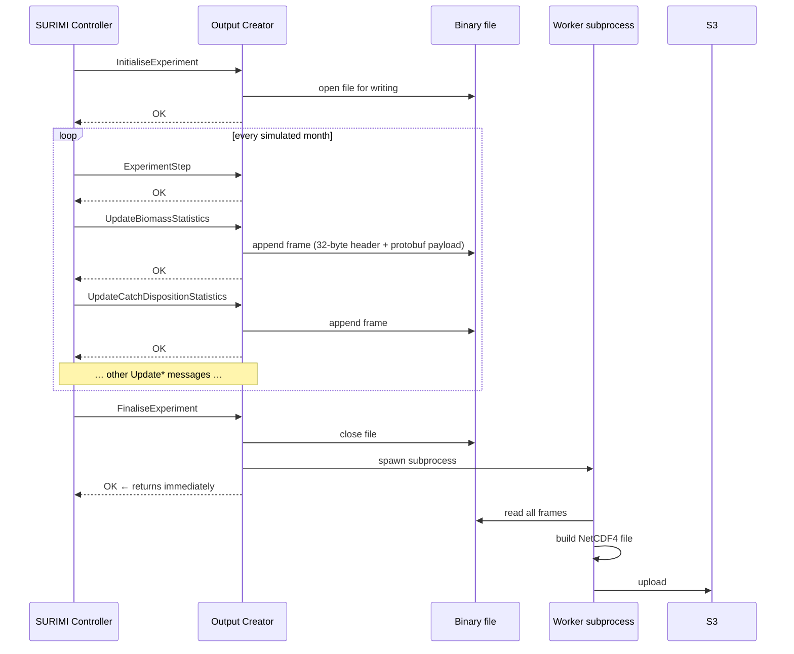
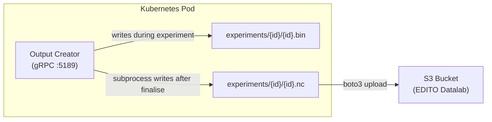

# output-creator — Architecture

## Overview

The Output Creator is a **Python gRPC server** and one of the core services of the SURIMI platform. Its sole responsibility is to **produce the output files of a SURIMI experiment**. Like all SURIMI services, it does not communicate directly with other simulation models — all inbound messages are forwarded by the **SURIMI Controller**, which orchestrates the experiment and routes gRPC calls to the correct service.

The SURIMI simulation models themselves do not produce any files. Instead, they send their results to the Output Creator as gRPC messages after each simulated time step. The Output Creator records these messages to a binary file and, once the experiment is finalised, generates a NetCDF4 output file and uploads it to S3.

The OutputCreator is written in **Python**. The recommended IDE for development is **Visual Studio Code (VS Code)**.

### Licence

The code is licenced under the **GNU General Public License v3.0 (GPL-3.0)**. See the `LICENSE` file in the root of the repository for the full licence text.

---

## Responsibilities

- Accept and validate experiment lifecycle messages (`InitialiseExperiment`, `ExperimentStep`, `FinaliseExperiment`, `CancelExperiment`).
- Receive statistics messages from the simulation each simulated month and record them to a binary file on disk.
- After finalisation, spawn a subprocess that reads the binary file and writes a NetCDF4 output file.
- Upload the finished output files to an S3 bucket.
- Expose gRPC reflection so that tools like Postman can discover available methods automatically.

### Build outputs

This is a Python project — there are no compiled binaries. The single build output is a **Docker image**:

| Artifact | Description |
|---|---|
| `ghcr.io/official-ewe/surimioutputcreator:latest` | The containerised gRPC server. Built from the `Dockerfile` in the repository root and pushed to the GitHub Container Registry (GHCR) by the CI/CD pipeline on every push to `master`. |

---

## Interfaces

All messages are received by the Output Creator (it acts as a gRPC **server**). There are no outbound gRPC calls.

### Lifecycle messages

These messages control the experiment lifecycle. Their content is **not** written to the binary recording file.

| Message | Description |
|---|---|
| `InitialiseExperiment` | Creates a new experiment record and opens the binary recording file |
| `ExperimentStep` | Signals the start of a new simulated month; acknowledged immediately |
| `FinaliseExperiment` | Closes the binary file and spawns the output-generation subprocess |
| `CancelExperiment` | Closes and deletes the binary file; no output is produced |
| `GetProtocolVersion` | Returns the currently loaded protocol version; no experiment state involved |

### Statistics messages

These messages carry the actual simulation statistics. Each is serialised as a binary frame and appended to the recording file.

| Message | Description | Frame type |
|---|---|---|
| `UpdateBiomassStatistics` | Mean biomass per species/life-stage per grid cell | 2 |
| `UpdateSalesStatistics` | Mean sales value and quantity per species/fleet/market | 3 |
| `UpdateCatchDispositionStatistics` | Mean gross catch, live discards, and dead discards per species/fleet/grid cell | 4 |
| `UpdateFishingActivityStatistics` | Fishing activity ratio per fleet segment | 5 |
| `UpdateSpeciesPriceStatistics` | Mean price per species/market/category | 6 |
| `UpdateStockAssessment` | Stock status and exploitation rate per species/year | 7 |

> All message types are defined in the `surimi-surimi-protocol-grpc-python` package (installed from the Buf Schema Registry). There are no `.proto` files in this repository.

---

## Model theory

### Management Strategy Evaluation (MSE)

SURIMI uses **Management Strategy Evaluation (MSE)**: a simulation technique for assessing the robustness of a fisheries management strategy under uncertainty. In an MSE experiment the simulation is run many times in parallel, each time with slightly varied inputs (e.g. different recruitment variability or stock-assessment noise). The Output Creator receives the *mean* of all parallel runs for each statistic — for example the mean biomass or mean sales across all simulations — and stores this as the experiment's output.

### Incremental NetCDF4 writes

Large experiments (e.g. 50 years × monthly steps × 109 × 82 grid × 97 species × 9 fleets) would require tens of gigabytes of RAM if all data were held in memory before writing. To avoid this, the Output Creator writes each monthly time-slice (~30 MB) to the NetCDF4 file immediately after it is computed, keeping peak memory in the hundreds of megabytes rather than tens of gigabytes.

### Key concept — the messages *are* the output.
The SURIMI simulation models themselves do not produce any files. Instead, they send their results to the Output Creator as gRPC messages after each simulated time step. It is the *ensemble* of all these messages — aggregated across all parallel model runs — that defines what the output of an experiment contains.

---

## Service architecture

The Output Creator is a single-process Python gRPC server that listens on port `5189` and handles all inbound messages from the SURIMI Controller. It follows a **two-phase record-then-replay** design: during an experiment, every statistics message is immediately serialised and appended to a binary file by a background writer thread, so the gRPC response path is never blocked on disk I/O. Once the experiment is finalised, a separate Python subprocess (`netcdf_worker_main.py`) is spawned to read the binary file and produce a NetCDF4 output file, allowing the `FinaliseExperiment` call to return to the controller without waiting for output generation. The finished output files are uploaded to an S3-compatible object store via `boto3`. The server uses gRPC interceptors for cross-cutting concerns: one attaches protocol-version metadata to every response, and another catches unhandled exceptions and converts them into structured gRPC errors.

### High-Level Architecture

The Output Creator uses a **two-phase record-then-replay** design to minimise the overhead imposed on the running simulation:

1. **Record phase** — During the experiment every statistics message is serialised and appended to a binary file by a background writer thread. The gRPC handler enqueues the serialised bytes and returns immediately, so the simulation is never blocked on disk I/O.
2. **Replay phase** — After `FinaliseExperiment` is received, a separate Python subprocess (`netcdf_worker_main.py`) reads the binary file frame by frame, reconstructs the time-series data, and writes a NetCDF4 file. The `FinaliseExperiment` RPC call itself returns immediately to the caller; output generation (10–15 minutes for a 50-year, large-area experiment) happens independently.



#### The Two-Phase Design: Record → Replay

To minimise the overhead imposed on the running simulation, the Output Creator uses a **record-then-replay** approach:



#### Binary frame format

Each recorded message is stored as a **32-byte header** followed by the raw protobuf payload:

```
┌────────────┬────────────┬─────────────┬──────────┬───────┬────────────┬──────────┬──────────┐
│ payload    │ frame type │ timestamp   │ sequence │ flags │ header crc │ payload  │ reserved │
│ length (4) │ (4)        │ ns (8)      │ (4)      │ (2)   │ (2)        │ crc32(4) │ (4)      │
└────────────┴────────────┴─────────────┴──────────┴───────┴────────────┴──────────┴──────────┘
                               32 bytes total
```
The recorder runs a **background writer thread** (`binary_recorder`). The gRPC handler calls `recorder.record(...)` which enqueues the serialised message and returns immediately — the disk write happens off the critical path, so the simulation is not blocked.

#### Output subprocess

`FinaliseExperiment` spawns `netcdf_worker_main.py` as a separate Python subprocess. This means the gRPC `FinaliseExperiment` call returns immediately to the simulation, while output generation (which can take 10–15 minutes for a 50-year, large-area experiment) runs independently in the same Kubernetes pod.

### Message flow



### Key design decisions / trade-offs

| Decision | Rationale |
|---|---|
| Background writer thread | Decouples disk I/O from the gRPC response path; the simulation is never blocked waiting for a write to complete |
| Subprocess for output generation | Output generation runs completely independently; the `FinaliseExperiment` call returns immediately to the controller |
| Incremental NetCDF4 writes | Keeps peak memory at ~hundreds of MB instead of ~tens of GB for large spatial experiments |
| `complevel=1` zlib compression | Balances file size against write latency; higher compression levels significantly increase write time |
| gRPC reflection enabled | Allows Postman and other tools to discover all available RPC methods without a `.proto` file |

#### Memory vs Processing Time Trade-off

Large experiments (e.g. 50 years of monthly steps over a 109 × 82 grid, 97 species combinations, 9 fleets) produce spatial arrays of:

```
3 × (445, 97, 9, 82, 109) @ float32 ≈ 39 GB   (catch variables)
1 × (445, 97, 82, 109)    @ float32 ≈  1.5 GB  (biomass)
```

The Output Creator handles this through **incremental writes**: instead of holding the full arrays in memory and writing at the end, it opens the NetCDF4 file at the start of output generation and writes each monthly time-slice (`≈ 30 MB`) to disk immediately after it is computed. Peak memory for spatial data is a few hundred megabytes rather than tens of gigabytes.

The downside is that every time-slice write incurs compression overhead. A lower compression level (`complevel=1`, fast zlib) is used to balance file size against write latency.

---

#### NetCDF vs Zarr

The Output Creator supports two output formats, selectable via `OutputType`:

##### NetCDF4 (default)
- The standard format in oceanography and fisheries science
- A single `.nc` file backed by HDF5; supports chunked, compressed storage
- Best tool for exploration: **Panoply** (free, from NASA GISS) — drag-and-drop visualisation with latitude/longitude map projections
- Also readable from Python (`xarray`, `netCDF4`), R, MATLAB, Julia, and most GIS tools
- Write-once, read-many; not well suited for partial updates after the file is closed

##### Zarr
- A cloud-native, chunked array format designed for object storage (S3, GCS)
- Each chunk is stored as a separate file/object — enables parallel reads and partial updates
- Ideal when downstream processing will read only slices of the data (e.g. one species at a time) from S3 directly
- Less universal tool support than NetCDF4 — mainly Python (`zarr`, `xarray`)
- Requires more code in the Output Creator (full in-memory arrays are still used in the current Zarr path)

---

### Output Datasets

The output is a single **NetCDF4** file (or optionally Zarr) containing the following variables:

#### Spatial variables
These cover the full raster grid `(time, …, lat, lon)`:

| Variable | Dimensions | Description |
|---|---|---|
| `biomass` | time × species × lat × lon | Mean biomass per species/life-stage per grid cell |
| `gross_catch` | time × species × fleet × lat × lon | Mean gross catch per species, fleet, and grid cell |
| `live_discards` | time × species × fleet × lat × lon | Mean live discards per species, fleet, and grid cell |
| `dead_discards` | time × species × fleet × lat × lon | Mean dead discards per species, fleet, and grid cell |

#### Aggregated (total) variables
These drop the spatial dimensions and sum over all grid cells, giving a quick time-series per species or fleet:

| Variable | Dimensions | Description |
|---|---|---|
| `biomass_total` | time × species | Total biomass (sum over all grid cells) |
| `gross_catch_total` | time × species × fleet | Total gross catch |
| `live_discards_total` | time × species × fleet | Total live discards |
| `dead_discards_total` | time × species × fleet | Total dead discards |

> **Note on the `_total` variables:** These are pre-computed to make it trivial to plot a time-series in a tool like Panoply without having to aggregate the spatial data yourself. They are not strictly necessary — you can always produce the same result in a Jupyter notebook by summing the spatial variable over `lat` and `lon`. They are kept for convenience.

#### Non-spatial variables

| Variable | Dimensions | Description |
|---|---|---|
| `price` | time × species × market × category | Mean price per species, market, and price category |
| `sales_value` | time × species × fleet × market | Mean sales value |
| `sales_quantity` | time × species × fleet × market | Mean sales quantity |
| `fishing_activity` | time × fleet | Fishing activity ratio per fleet |
| `stock_status` *(optional)* | year × species | Stock status index (only present when stock-assessment messages were received) |
| `exploitation` *(optional)* | year × species | Exploitation rate (only present when stock-assessment messages were received) |

---

## Error handling

All gRPC handlers validate the `experiment_id` before accessing state. If validation fails, `log_and_abort(context, grpc.StatusCode.INVALID_ARGUMENT, "...")` is called, which sets the gRPC status and returns cleanly — no exception propagates.

Unhandled exceptions are caught by the `exception_metadata_interceptor`. It logs the full traceback, attaches trailing metadata (`method` and `application` fields) to the response, and re-raises as a `GrpcException` with status `INTERNAL`, so the caller always receives a structured gRPC error rather than a raw Python exception.

---

## Logging

Logging is configured in `server/logging_formatter.py` using Python's standard `logging` module. A custom `SurimiFormatter` is attached to the root logger:

- `INFO` messages are formatted as `[HH:MM:SS] <message>`.
- All other levels (WARNING, ERROR, etc.) are formatted as `[HH:MM:SS] [LEVEL] <message>`.
- The default log level is `INFO`. Cell-level updates are logged at `DEBUG` level and are therefore not shown in normal operation, to avoid flooding the logs during large experiments.

---

## S3 bucket

After the NetCDF4 file is written, `netcdf_worker_main.py` calls `S3_Storage.UploadFilesToS3(...)`, which uploads every file under `experiments/{experiment_id}/` to the S3 path `output_creator/experiments/{experiment_id}/`. This includes both the binary recording file (`.bin`) and the finished NetCDF file (`.nc`).

### S3 bucket authentication

Authentication is performed using standard AWS credentials injected as environment variables (see [Environment](#environment) below). The `boto3` client is constructed with an explicit `endpoint_url` to support S3-compatible object stores (e.g. the EDITO Datalab MinIO endpoint) in addition to standard AWS S3:

```python
s3 = boto3.client(
    's3',
    aws_access_key_id=os.environ['AWS_ACCESS_KEY_ID'],
    aws_secret_access_key=os.environ['AWS_SECRET_ACCESS_KEY'],
    region_name=os.environ['AWS_DEFAULT_REGION'],
    endpoint_url="https://" + os.environ['AWS_S3_ENDPOINT'],
)
```

The credentials themselves are loaded from HashiCorp Vault at startup via `VaultService.LoadVaultSecretsInEnvironmentVariables()`.

---

## Kubernetes

The Output Creator is deployed as a **Docker container** inside the **EDITO Datalab Kubernetes cluster**. The container listens on port `5189` for gRPC traffic. Both the binary recording file and the finished NetCDF file are written to the pod's local ephemeral filesystem during processing; once the upload to S3 is complete, the files are no longer needed and will be lost when the pod is recycled.



---

## Environment

The following environment variables are used by the service. Vault credentials are typically stored in a local `.env` file (not committed to the repository); all other secrets are loaded from Vault at startup.

| Variable | Used by | Description |
|---|---|---|
| `VAULT_ADDR` | `vault_service.py` | URL of the HashiCorp Vault instance |
| `VAULT_TOKEN` | `vault_service.py` | Token used to authenticate with Vault |
| `VAULT_TOP_DIR` | `vault_service.py` | Top-level directory in the Vault KV store |
| `VAULT_RELATIVE_PATH` | `vault_service.py` | Relative path within the KV store to the secret |
| `VAULT_MOUNT` | `vault_service.py` | KV mount point in Vault |
| `AWS_BUCKET_NAME` | `s3_storage.py` | Name of the S3 bucket to upload results to |
| `AWS_ACCESS_KEY_ID` | `s3_storage.py` | AWS / S3-compatible access key ID |
| `AWS_SECRET_ACCESS_KEY` | `s3_storage.py` | AWS / S3-compatible secret access key |
| `AWS_DEFAULT_REGION` | `s3_storage.py` | AWS region (or equivalent for S3-compatible stores) |
| `AWS_S3_ENDPOINT` | `s3_storage.py` | Hostname of the S3-compatible endpoint (without `https://`) |

Copy `.env.example` to `.env` and fill in the Vault credentials for local development. The AWS credentials are then loaded automatically from Vault at startup.

---

## CI/CD

The GitHub Actions workflow (`.github/workflows/docker.yml`) triggers on every push to the `master` branch and performs the following steps:

1. Checks out the repository.
2. Logs in to the **GitHub Container Registry (GHCR)** using the automatically provided `GITHUB_TOKEN` secret.
3. Builds the Docker image from the `Dockerfile` in the repository root.
4. Pushes the image to `ghcr.io/official-ewe/surimioutputcreator:latest`.

There are currently no automated test steps in the CI pipeline. Integration tests must be run locally (see [Testing](#testing)).

---

## Technology stack

| Package | Role |
|---|---|
| `grpcio` | Core gRPC server framework |
| `grpc-interceptor` | Adds server-side interceptors for exception handling and protocol-version metadata |
| `grpcio-reflection` | Exposes gRPC reflection so Postman and other tools can discover RPC methods at runtime |
| `protobuf` | Deserialises incoming gRPC messages; stubs are generated from the Buf Schema Registry |
| `surimi-surimi-protocol-grpc-python` | Generated protobuf/gRPC stubs for all SURIMI message types (installed from `buf.build/gen/python`) |
| `netCDF4` | Direct low-level read/write of NetCDF4 (HDF5-backed) files via C bindings |
| `xarray` | Higher-level array abstraction; used for the Zarr output path |
| `numpy` | Spatial and temporal array manipulation |
| `zarr` | Alternative cloud-native chunked output format |
| `boto3` | Uploads output files from the pod to an S3-compatible object store |
| `hvac` | Loads credentials from HashiCorp Vault into environment variables at startup |
| `PyYAML` | YAML configuration parsing |
| `python-dotenv` | Loads `.env` file into environment variables for local development |
| `python-dateutil` | Date/time parsing utilities |
| `pytest` | Integration test framework |
| `pytest-timeout` | Per-test timeout support for integration tests |

---

## Project Structure

```
SURIMI-output-creator/
├── server/                              # Application source code
│   ├── app.py                           # Entry point — configures and starts the gRPC server
│   ├── output_creator_service.py        # gRPC servicer — implements all RPC methods
│   ├── surimi_output.py                 # Builds the NetCDF4/Zarr output file from recorded data
│   ├── binary_recorder.py               # Background-threaded binary file writer
│   ├── binary_reader.py                 # Reads binary file back frame by frame for replay
│   ├── experiment_recorder_manager.py   # Manages recorder lifetime per experiment
│   ├── netcdf_worker_main.py            # Subprocess entry point for output generation
│   ├── message_registry.py              # Maps message types ↔ frame type IDs ↔ handler methods
│   ├── s3_storage.py                    # Uploads/downloads results to/from S3
│   ├── vault_service.py                 # Loads secrets from HashiCorp Vault into env vars
│   ├── experiment.py                    # Experiment state dataclass
│   ├── common_functions.py              # Shared helpers (log_and_abort, require_not_empty)
│   ├── logging_formatter.py             # Custom log formatter and root logger configuration
│   ├── exception_metadata_interceptor.py  # Intercepts unhandled exceptions; attaches gRPC metadata
│   └── version_metadata_interceptor.py  # Attaches protocol version to every response
│
├── integration_tests/
│   ├── grpc_messages/                   # Valid JSON example payloads for every message type
│   │   ├── InitialiseExperiment/
│   │   ├── ExperimentStep/
│   │   ├── FinaliseExperiment/
│   │   ├── CancelExperiment/
│   │   ├── GetProtocolVersion/
│   │   ├── UpdateBiomassStatistics/
│   │   ├── UpdateCatchDispositionStatistics/
│   │   ├── UpdateSalesStatistics/
│   │   ├── UpdateSpeciesPrices/
│   │   ├── UpdateFishingActivity/
│   │   └── UpdateStockAssessmentRequest/
│   └── tests/
│       └── test_valid_grpc_messages.py  # Validates every JSON fixture against the protobuf schema
│
├── experiments/                         # Runtime output directory (gitignored)
├── .github/
│   └── workflows/
│       └── docker.yml                   # CI/CD: build and push Docker image to GHCR
├── .env.example                         # Template for local Vault credentials
├── Dockerfile                           # Container image definition
└── requirements.txt                     # Python dependencies
```

---

## Source control

The repository is hosted on **GitHub** at `github.com/Official-EwE/SURIMI-output-creator` and uses **Git** for version control.

There are no Git submodules. The gRPC/protobuf stubs are not vendored into the repository — they are installed at runtime as a pip package (`surimi-surimi-protocol-grpc-python`) from the Buf Schema Registry. This means there are no `.proto` files in the repository.

---

## Testing

### Automated tests

Integration tests live in `integration_tests/tests/test_valid_grpc_messages.py`. The test `test_grpc_message_is_valid` is parameterised over every JSON file found under `integration_tests/grpc_messages/`. For each file it calls `google.protobuf.json_format.ParseDict` with `ignore_unknown_fields=False`, verifying that the JSON matches the current protobuf schema exactly. This catches schema drift early when the `surimi-surimi-protocol-grpc-python` package is updated.

Run the tests with:

```bash
pytest integration_tests/
```

---

### Manual testing with Postman

The JSON files in `integration_tests/grpc_messages/` can be pasted directly into Postman's gRPC request body for manual end-to-end testing against a locally running server on `localhost:5189`. Because gRPC reflection is enabled, Postman can discover all available RPC methods automatically — no `.proto` file needs to be imported.

## Viewing the Output

### Panoply (recommended for exploration)
[Panoply](https://www.giss.nasa.gov/tools/panoply/) is a free cross-platform viewer from NASA GISS. It opens `.nc` files directly and renders lat/lon maps, time-series plots, and variable browsers with no configuration needed. It is the quickest way to do a sanity check on the spatial output.

### Jupyter Notebooks
For programmatic analysis, the [SURIMI Jupyter Notebooks](https://github.com/Official-EwE/SURIMI-jupyter-notebooks) repository contains examples showing how to open the output file with `xarray`, plot time-series with `matplotlib`, and aggregate spatial variables. For example, to reproduce a `_total` variable from the spatial data:

```python
import xarray as xr

ds = xr.open_dataset("9a400ee8-e10a-46b1-84ad-3b7dde5a4eb7.nc")

# equivalent to the pre-computed gross_catch_total variable
gross_catch_total = ds["gross_catch"].sum(dim=["lat", "lon"])
```
