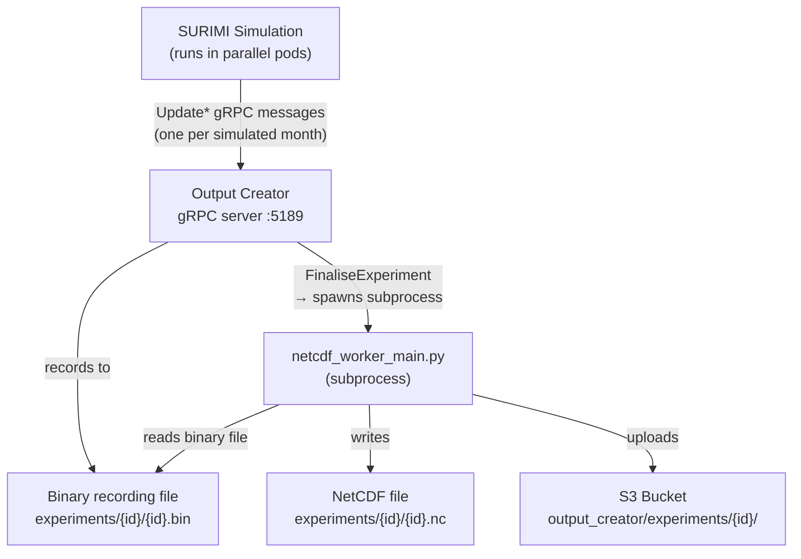
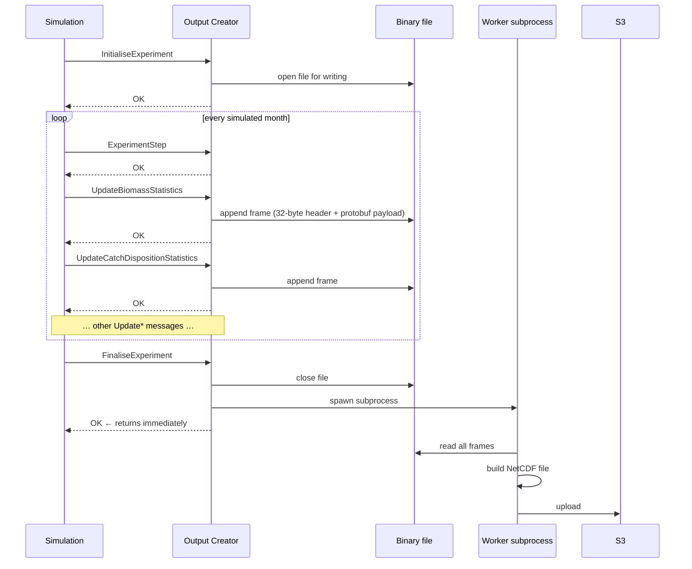
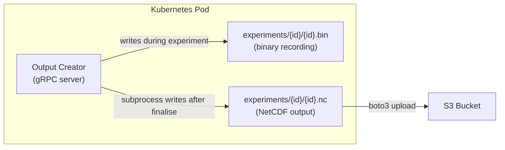

# SURIMI Output Creator — Architecture

## What is the Output Creator?

The Output Creator is a **Python gRPC server** and one of the core services of the SURIMI platform. Its sole responsibility is to **produce the output files of a SURIMI experiment**.

> **Key concept — the messages *are* the output.**
> The SURIMI simulation models themselves do not produce any files. Instead, they send their results to the Output Creator as gRPC messages after each simulated time step. It is the *ensemble* of all these messages — aggregated across all parallel model runs — that defines what the output of an experiment contains.

---

## SURIMI and Management Strategy Evaluation (MSE)

SURIMI uses **Management Strategy Evaluation (MSE)**: a technique for assessing the robustness of a fisheries management strategy. In an MSE experiment, the simulation is run many times in parallel, each time with slightly varied inputs (e.g. different recruitment variability or stock assessments). The Output Creator receives the *mean* of all parallel runs for each statistic — for example, the mean Biomass or mean Sales across all simulations — and stores it as the experiment's output.

---

## Technology Stack

| Package | Role |
|---|---|
| `grpcio` + `grpc-interceptor` | gRPC server framework; interceptors add exception metadata and protocol version to every response |
| `protobuf` | Deserialises incoming gRPC messages; all message types are generated stubs from the `surimi-surimi-protocol-grpc-python` package |
| `netCDF4` | Direct low-level read/write of NetCDF4 (HDF5-backed) files via C bindings — used for the primary output format |
| `xarray` | Higher-level array abstraction; used for the Zarr output path |
| `numpy` | All spatial and temporal data arrays |
| `zarr` | Alternative output format (chunked, cloud-friendly) |
| `boto3` | Uploads the finished output file from the Kubernetes pod to an S3 bucket |
| `hvac` | Loads credentials from HashiCorp Vault into environment variables at startup |
| `PyYAML` / `python-dotenv` | Configuration and local `.env` secrets |

---

## High-Level Architecture



---

## Message Flow

### Lifecycle messages (not recorded to disk)

These messages control the experiment lifecycle but their content is not written to the binary file:

| Message | Purpose |
|---|---|
| `InitialiseExperiment` | Creates the experiment record, opens the binary recording file |
| `ExperimentStep` | Signals the start of a new simulated month; acknowledged immediately |
| `FinaliseExperiment` | Closes the binary file and spawns the output subprocess |
| `CancelExperiment` | Closes and deletes the binary file; no output is produced |
| `GetProtocolVersion` | Returns the protocol version; no experiment state involved |

### Statistics messages (recorded to binary file)

These messages carry the actual simulation statistics and are serialised to the binary recording file as they arrive:

| Message | What it contains | Frame type |
|---|---|---|
| `UpdateBiomassStatistics` | Mean biomass per species/life-stage, per grid cell | 2 |
| `UpdateSalesStatistics` | Mean sales value and quantity per species/fleet/market | 3 |
| `UpdateCatchDispositionStatistics` | Mean gross catch, live discards, and dead discards per species/fleet/grid cell | 4 |
| `UpdateFishingActivityStatistics` | Fishing activity ratio per fleet segment | 5 |
| `UpdateSpeciesPriceStatistics` | Mean price per species/market/category | 6 |
| `UpdateStockAssessmentRequest` | Stock status and exploitation rate per species/year | 7 |

---

## The Two-Phase Design: Record → Replay

To minimise the overhead imposed on the running simulation, the Output Creator uses a **record-then-replay** approach:



### Binary frame format

Each recorded message is stored as a **32-byte header + protobuf payload**:

```
┌────────────┬────────────┬─────────────┬──────────┬───────┬────────────┬──────────┬──────────┐
│ payload    │ frame type │ timestamp   │ sequence │ flags │ header crc │ payload  │ reserved │
│ length (4) │ (4)        │ ns (8)      │ (4)      │ (2)   │ (2)        │ crc32(4) │ (4)      │
└────────────┴────────────┴─────────────┴──────────┴───────┴────────────┴──────────┴──────────┘
                               32 bytes total
```

The recorder runs a **background writer thread** (`binary_recorder`). The gRPC handler calls `recorder.record(...)` which enqueues the serialised message and returns immediately — the disk write happens off the critical path, so the simulation is not blocked.

### Output subprocess

`FinaliseExperiment` spawns `netcdf_worker_main.py` as a separate Python subprocess. This means the gRPC `FinaliseExperiment` call returns immediately to the simulation, while output generation (which can take 10–15 minutes for a 50-year, large-area experiment) runs independently in the same Kubernetes pod.

---

## Output Datasets

The output is a single **NetCDF4** file (or optionally Zarr) containing the following variables:

### Spatial variables
These cover the full raster grid `(time, …, lat, lon)`:

| Variable | Dimensions | Description |
|---|---|---|
| `biomass` | time × species × lat × lon | Mean biomass per species/life-stage per grid cell |
| `gross_catch` | time × species × fleet × lat × lon | Mean gross catch per species, fleet, and grid cell |
| `live_discards` | time × species × fleet × lat × lon | Mean live discards per species, fleet, and grid cell |
| `dead_discards` | time × species × fleet × lat × lon | Mean dead discards per species, fleet, and grid cell |

### Aggregated (total) variables
These drop the spatial dimensions and sum over all grid cells, giving a quick time-series per species or fleet:

| Variable | Dimensions | Description |
|---|---|---|
| `biomass_total` | time × species | Total biomass (sum over all grid cells) |
| `gross_catch_total` | time × species × fleet | Total gross catch |
| `live_discards_total` | time × species × fleet | Total live discards |
| `dead_discards_total` | time × species × fleet | Total dead discards |

> **Note on the `_total` variables:** These are pre-computed to make it trivial to plot a time-series in a tool like Panoply without having to aggregate the spatial data yourself. They are not strictly necessary — you can always produce the same result in a Jupyter notebook by summing the spatial variable over `lat` and `lon`. They are kept for convenience.

### Non-spatial variables

| Variable | Dimensions | Description |
|---|---|---|
| `price` | time × species × market × category | Mean price per species, market, and price category |
| `sales_value` | time × species × fleet × market | Mean sales value |
| `sales_quantity` | time × species × fleet × market | Mean sales quantity |
| `fishing_activity` | time × fleet | Fishing activity ratio per fleet |
| `stock_status` *(optional)* | year × species | Stock status index (only present when stock-assessment messages were received) |
| `exploitation` *(optional)* | year × species | Exploitation rate (only present when stock-assessment messages were received) |

---

## Memory vs Processing Time Trade-off

Large experiments (e.g. 50 years of monthly steps over a 109 × 82 grid, 97 species combinations, 9 fleets) produce spatial arrays of:

```
3 × (445, 97, 9, 82, 109) @ float32 ≈ 39 GB   (catch variables)
1 × (445, 97, 82, 109)    @ float32 ≈  1.5 GB  (biomass)
```

The Output Creator handles this through **incremental writes**: instead of holding the full arrays in memory and writing at the end, it opens the NetCDF4 file at the start of output generation and writes each monthly time-slice (`≈ 30 MB`) to disk immediately after it is computed. Peak memory for spatial data is a few hundred megabytes rather than tens of gigabytes.

The downside is that every time-slice write incurs compression overhead. A lower compression level (`complevel=1`, fast zlib) is used to balance file size against write latency.

---

## NetCDF vs Zarr

The Output Creator supports two output formats, selectable via `OutputType`:

### NetCDF4 (default)
- The standard format in oceanography and fisheries science
- A single `.nc` file backed by HDF5; supports chunked, compressed storage
- Best tool for exploration: **Panoply** (free, from NASA GISS) — drag-and-drop visualisation with latitude/longitude map projections
- Also readable from Python (`xarray`, `netCDF4`), R, MATLAB, Julia, and most GIS tools
- Write-once, read-many; not well suited for partial updates after the file is closed

### Zarr
- A cloud-native, chunked array format designed for object storage (S3, GCS)
- Each chunk is stored as a separate file/object — enables parallel reads and partial updates
- Ideal when downstream processing will read only slices of the data (e.g. one species at a time) from S3 directly
- Less universal tool support than NetCDF4 — mainly Python (`zarr`, `xarray`)
- Requires more code in the Output Creator (full in-memory arrays are still used in the current Zarr path)

---

## Project Structure

```
SURIMI-output-creator/
├── server/                          # Application code
│   ├── app.py                       # Entry point — builds and starts the gRPC server
│   ├── output_creator_service.py    # gRPC servicer — handles all RPC methods
│   ├── surimi_output.py             # Builds the NetCDF/Zarr output file
│   ├── binary_recorder.py           # Background-threaded binary file writer
│   ├── binary_reader.py             # Reads the binary file back frame by frame
│   ├── experiment_recorder_manager.py  # Manages recorder lifetime per experiment
│   ├── netcdf_worker_main.py        # Subprocess entry point for output generation
│   ├── message_registry.py          # Maps message types ↔ frame types ↔ handler methods
│   ├── s3_storage.py                # Uploads results to S3
│   ├── vault_service.py             # Loads secrets from HashiCorp Vault
│   ├── experiment.py                # Experiment state dataclass
│   ├── common_functions.py          # Shared helpers (log_and_abort, etc.)
│   ├── exception_metadata_interceptor.py
│   └── version_metadata_interceptor.py
│
├── integration_tests/
│   ├── grpc_messages/               # Example JSON messages for every message type
│   │   ├── InitialiseExperiment/
│   │   ├── UpdateBiomassStatistics/
│   │   ├── UpdateCatchDispositionStatistics/
│   │   ├── UpdateSalesStatistics/
│   │   ├── UpdateSpeciesPrices/
│   │   ├── UpdateFishingActivity/
│   │   ├── FinaliseExperiment/
│   │   ├── CancelExperiment/
│   │   ├── ExperimentStep/
│   │   └── GetProtocolVersion/
│   └── tests/
│       └── test_valid_grpc_messages.py
│
├── experiments/                     # Runtime output (gitignored)
├── Dockerfile
└── requirements.txt
```

---

## Integration Tests and Postman

The `integration_tests/grpc_messages/` directory contains **valid JSON example payloads** for every message type. These serve two purposes:

1. **Automated validation** — `test_grpc_message_is_valid` in `test_valid_grpc_messages.py` runs `pytest` over every JSON file and verifies that it parses correctly against the protobuf schema (with `ignore_unknown_fields=False`). This catches schema drift early.

2. **Manual testing with Postman** — the same JSON files can be pasted directly into Postman's gRPC request body when testing against a locally running server on `localhost:5189`. The server exposes gRPC reflection, so Postman can discover all available methods automatically.

---

## Logging

All server activity is written through Python's standard `logging` module, configured via `server/logging_formatter.py`. Every gRPC handler logs at `INFO` level when it starts and finishes. Cell-level updates are logged at `DEBUG` level (not shown by default) to avoid flooding the logs during large experiments.

---

## Infrastructure: Kubernetes Pod → S3

The Output Creator runs as a **Docker container** inside a Kubernetes pod:



Both the binary recording file and the finished NetCDF file live on the pod's local filesystem during processing. Once `netcdf_worker_main.py` finishes, it calls `S3_Storage.UploadFilesToS3(...)` to copy everything under `experiments/{id}/` to `output_creator/experiments/{id}/` in S3. The pod's local files are ephemeral — they disappear when the pod is recycled.

---

## Viewing the Output

### Panoply (recommended for exploration)
[Panoply](https://www.giss.nasa.gov/tools/panoply/) is a free cross-platform viewer from NASA GISS. It opens `.nc` files directly and renders lat/lon maps, time-series plots, and variable browsers with no configuration needed. It is the quickest way to do a sanity check on the spatial output.

### Jupyter Notebooks
For programmatic analysis, the [SURIMI Jupyter Notebooks](https://github.com/Official-EwE/SURIMI-jupyter-notebooks) repository contains examples showing how to open the output file with `xarray`, plot time-series with `matplotlib`, and aggregate spatial variables. For example, to reproduce a `_total` variable from the spatial data:

```python
import xarray as xr

ds = xr.open_dataset("9a400ee8-e10a-46b1-84ad-3b7dde5a4eb7.nc")

# equivalent to the pre-computed gross_catch_total variable
gross_catch_total = ds["gross_catch"].sum(dim=["lat", "lon"])
```
